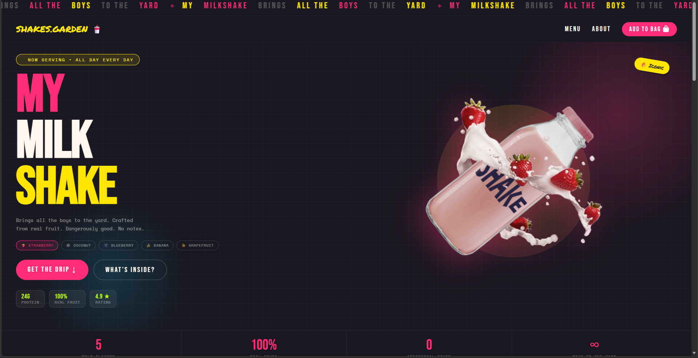
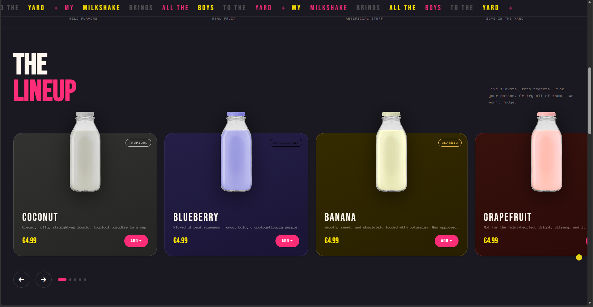
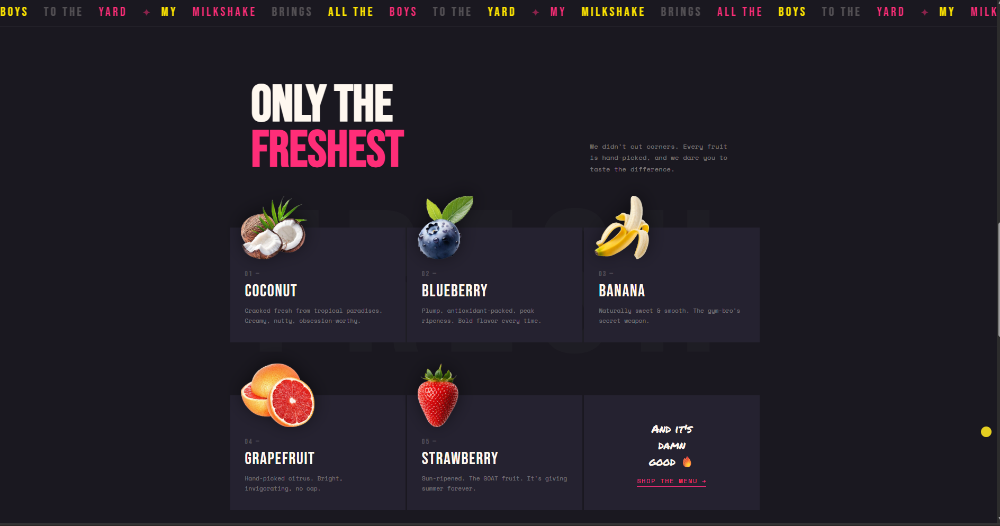

# Shake Yard 🥤 - Milkshake Brand Landing Page





A vibrant, fully responsive animated product landing page for a fictional milkshake brand, "Shake Garden." It features a premium, modern aesthetic with smooth interactions, custom animations, and a user-friendly layout.

## ✨ Features

- **Dynamic Hero Section:** Interactive flavor switcher that dynamically updates the hero image and active pill.
- **Custom Cursor:** A mix-blend-mode custom cursor that reacts and enlarges when hovering over clickable elements (links, buttons, product cards).
- **Sticky Marquee Ticker:** An infinitely scrolling animated marquee displaying brand messaging.
- **Draggable CSS Slider:** A smooth, touch-friendly product slider for "The Lineup" with dot navigation and arrow controls.
- **Floating Ingredient Cards:** A visually striking layout explaining the fresh ingredients.
- **Modern Design System:** A tokenized design system using CSS variables (custom properties) for a consistent dark theme with vibrant accents (hot pink, yellow, cream).
- **Fully Responsive:** Adapts seamlessly to all screen sizes, from mobile devices to large desktop monitors.
- **No Dependencies:** Built with pure HTML5, CSS3, and Vanilla JavaScript. No frameworks or external libraries required (except for FontAwesome icons).

## 🛠️ Built With

- **HTML5** - Semantic markup
- **CSS3** - Flexbox, CSS Grid, Custom Properties, Keyframe Animations, Transitions
- **Vanilla JavaScript(ES6+)** - DOM Manipulation, Event Listeners, Drag/Touch events for the slider
- **FontAwesome** - For scalable vector icons
- **Google Fonts** - *Outfit* (main typography) and *Permanent Marker* (accent typography)

## 📁 Project Structure

```text
📦 milkshake-brand-landing-page
 ┣ 📂 src            # Production-ready minified files
 ┃ ┣ 📜 index.html
 ┃ ┣ 📜 style.css
 ┃ ┗ 📜 script.js
 ┣ 📂 preview         # Preview screenshots
 ┣ 📜 README.md       # Project documentation


## 🚀 Getting Started

Since this project uses plain HTML, CSS, and JavaScript without any build tools or bundlers, getting it running is incredibly simple.

### Prerequisites

You only need a modern web browser (Chrome, Firefox, Safari, Edge).

### Installation & Usage

1. **Clone the repository** (if you haven't already):
   ```bash
   git clone:(https://github.com/ManasBisht81/Milk-shake-brand-landing-page.git)
   ```
2. **Navigate to the project directory:**
   ```bash
   cd milkshake-brand-landing-page-css-slider-marquee-ticker-custom-cursor
   ```
3. **Open the project:**
   Simply double-click the `dist/index.html` file to open it in your default web browser. Alternatively, you can use an extension like **Live Server** in VS Code to run it on a local development server with hot reloading.

---
*It was inspired to create by [Margarita-the-solid].